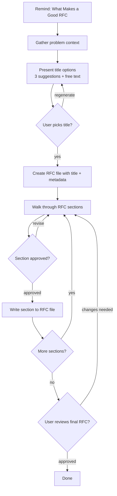

# Write RFC

Guide users through writing a well-structured RFC (Request for Comments) using an interactive, collaborative flow.

## What Makes a Good RFC

Before starting, remind the user of these five principles:

1. **Clear Problem Statement** — The reader should understand the problem in under 60 seconds
2. **Focus on the Problem Before the Solution** — Spend more time on "why" than "how"
3. **Compare Alternatives** — Show you considered other paths and explain why you chose this one
4. **Concrete Implementation Plan** — Enough detail that someone could pick this up and build it
5. **Easy to Review** — Short, scannable, with bullet points and diagrams over prose

## Process Flow

## Step-by-Step Instructions

### Step 1: Remind — What Makes a Good RFC

Display the five principles above to the user. This sets expectations and primes them for the right level of detail.

### Step 2: Gather Problem Context

Ask the user **one question at a time**:

1. "What problem are you trying to solve?" — Get the core problem statement
2. "Who is affected and what's the impact?" — Understand scope and urgency

Keep it to 1-2 questions. Don't over-interview.

### Step 3: Title Selection

Based on the problem context, use **AskUserQuestion** to present a menu:

- **Option 1-3:** Three suggested RFC titles — concise, descriptive, action-oriented (e.g., "Migrate Auth Service to OAuth 2.0")
- **Option 4 (Other):** The user types their own title (AskUserQuestion provides this automatically)

Pick titles that are specific and scannable. Avoid generic titles like "Improve Performance."

**Once the user picks a title, create the RFC file** at `docs/rfcs/YYYY-MM-DD-<title-slug>.md` with the title and metadata (author, date, status: Draft). Sections will be appended as they are approved.

### Step 4: Walk Through RFC Sections

Guide the user through each section **one at a time**. For each section:

- Briefly explain what belongs in this section (1 sentence)
- Ask the user for their input
- Draft the section content based on their response
- Ask if it looks right before moving on
- **Once the user approves a section, immediately write it to the RFC file** — don't wait until the end to compile everything. This gives the user a progressively complete document they can review at any time

**RFC Structure (11 sections):**

| #   | Section                     | Guidance                                                                        |
| --- | --------------------------- | ------------------------------------------------------------------------------- |
| 1   | **Title**                   | Already selected in Step 3                                                      |
| 2   | **Summary**                 | 2-3 sentence elevator pitch of the proposal                                     |
| 3   | **Problem Statement**       | What's broken or missing? Who feels the pain? Use concrete examples             |
| 4   | **Goals**                   | What does success look like? Bullet list of measurable outcomes                 |
| 5   | **Out-of-scope**            | What are you explicitly NOT doing? Prevents scope creep                         |
| 6   | **Proposed Solution**       | The "how" — architecture, components, data flow. Use diagrams and bullet points |
| 7   | **Alternatives Considered** | 2-3 other approaches with pros/cons. Show your reasoning                        |
| 8   | **Trade-offs**              | What are you giving up? Be honest about costs and risks                         |
| 9   | **Implementation Plan**     | Phases, milestones, key tasks. Enough detail to estimate work                   |
| 10  | **Rollout Plan**            | How will you ship it? Feature flags, migration steps, rollback strategy         |
| 11  | **Open Questions**          | What's unresolved? What needs discussion? This is where reviewers focus         |

### Step 5: Final Review

Since each section was written to the file as it was approved, the RFC is already complete by this point.

- Show the user the final document for a last review
- Make any final adjustments if requested
- Commit to git when approved

## Writing Tips (Enforce These)

These tips shape how you draft each section:

- **Keep it short:** Target 1000-3000 words total. If it's longer, cut ruthlessly
- **Write like a design doc, not a novel:** Bullet points, tables, diagrams, examples. No walls of text
- **RFCs are for discussion:** Leave room for feedback. Don't present everything as decided — the Open Questions section matters
- **Record decisions:** When the user makes a choice during the process, capture the reasoning — future readers need to know _why_, not just _what_

## Common Mistakes

| Mistake                                     | Fix                                                                |
| ------------------------------------------- | ------------------------------------------------------------------ |
| Jumping to solution before defining problem | Spend 2x more time on Problem Statement than Proposed Solution     |
| RFC is 5000+ words                          | Cut. If a section is over 300 words, break it into bullets         |
| No alternatives considered                  | Always list at least 2 alternatives, even if they're clearly worse |
| Vague implementation plan                   | Add phases, milestones, and rough ordering                         |
| Missing out-of-scope                        | Explicitly list 3+ things you're NOT doing                         |
| Open questions section is empty             | If nothing is unresolved, you haven't thought hard enough          |

## Red Flags — STOP and Reconsider

- Skipping the problem statement to jump to solutions
- Writing prose paragraphs instead of bullet points
- RFC exceeds 3000 words without good reason
- No alternatives section ("this is obviously the right approach")
- Empty open questions
